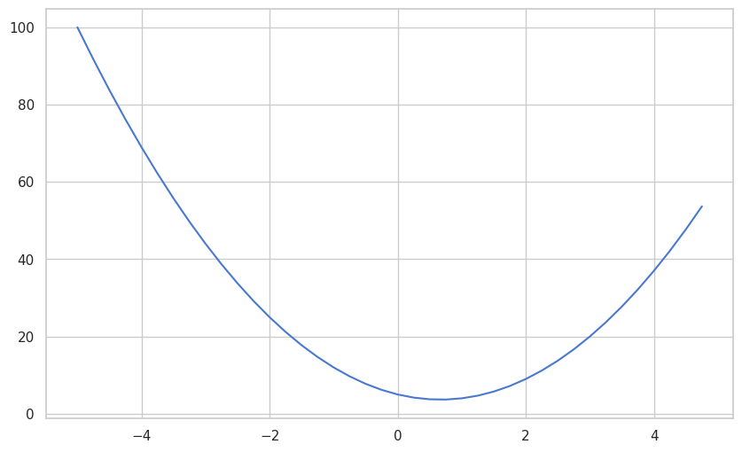

This post contains my notes on the first video in Andrej Karpathy's YouTube course: Neural Networks: Zero to Hero. The first video in this course's playlist is [The spelled-out intro to neural networks and backpropagation: building micrograd](https://www.youtube.com/watch?v=VMj-3S1tku0&list=PLAqhIrjkxbuWI23v9cThsA9GvCAUhRvKZ&index=1). It's a very thorough, intuitive introduction to **neural networks** and **backpropagation**, that requires some knowledge of <u>Python</u> and <u>calculus</u> (eg. chain rule, partial differentiation

I used Google Colab to setup the Python notebook; all source code can be found at this GitHub repo: **link here**.

## Micrograd
The video essential involves building [micrograd](https://github.com/karpathy/micrograd) from scratch, which is a tiny, efficient **Autograd** engine developed by Karpathy that uses very simple scalar values to implement backpropagation and a small neural networks library (with a PyTorch-like API). As the video progresses, we will be able to understand micrograd more and more.

This is a code snippet from micrograd's GitHub readme:
```python
from micrograd.engine import Value

a = Value(-4.0)
b = Value(2.0)
c = a + b
d = a * b + b**3
c += c + 1
c += 1 + c + (-a)
d += d * 2 + (b + a).relu()
d += 3 * d + (b - a).relu()
e = c - d
f = e**2
g = f / 2.0
g += 10.0 / f
print(f'{g.data:.4f}') # prints 24.7041, the outcome of this forward pass
g.backward()
print(f'{a.grad:.4f}') # prints 138.8338, i.e. the numerical value of dg/da
print(f'{b.grad:.4f}') # prints 645.5773, i.e. the numerical value of dg/db
```

Essentially, some scalar values are being initialized (`a` and `b`), and they are manipulated through addition, multiplication, and negation, exponential functions, and even squeezed to zero (`.relu()` basically returns the max of 0 and the input, zeroing out any negative values). The important line is when `g.backward()` is called, which initializes backprop at g, going backwards in the expression graph and recursively applying the chain rule of calculus which allows us to evaluate the partial differentiation of input variables.

This can be seen when `a.grad` is printed, which tells us how the function of `g` responds when `a` is increased by an infinitesimally small amount, which is basically the instantaneous slope or derivative $\frac{dg}{da}$, as it is known in the field of calculus.

### Chain Rule: $\frac{dy}{dx} = \frac{dy}{du} \cdot \frac{du}{dx}$
For example, if $y = 3(2x + 2)^2$, $\frac{dy}{dx} = 6u \cdot 2$, where $u = 2x + 2$. Chain rule involves taking the derivative of the outside, then multiplying by the derivative of the inside..

## Explanation of Derivatives in Python
To start, all the basic libraries such as math, NumPy, and Matplotlib are imported.

```python
import math
import numpy as np
import matplotlib.pyplot as plt

# Optional stylistic changes
import seaborn as sns

sns.set_theme(style="whitegrid", palette="muted")
plt.rcParams['figure.figsize'] = (10, 6)
plt.rcParams['figure.dpi'] = 100
```


Karpathy starts off by defining a function $f(x) = 3x^2 -4x + 5$.
```python
def f(x):
    return 3*x**2 - 4*x + 5
```
Calling `f(3.0)` passes in $3.0$ as the $x$ value into $f(x)$; this returns $20.0$.

We can apply this function $f(x)$ to a range of values using the `arange()` function from `numpy`.
```python
xs = np.arange(-5, 5, 0.25) # this creates a range from -5 to 5, with steps of 0.25
xs
```
This outputs the numpy array `xs`: ```[-5.00, -4.75, -4.50, -4.25, -4.00, -3.75, -3.50, -3.25, -3.00,
 -2.75, -2.50, -2.25, -2.00, -1.75, -1.50, -1.25, -1.00, -0.75,
 -0.50, -0.25,  0.00,  0.25,  0.50,  0.75,  1.00,  1.25,  1.50,
  1.75,  2.00,  2.25,  2.50,  2.75,  3.00,  3.25,  3.50,  3.75,
  4.00,  4.25,  4.50,  4.75]```
These values represent the y-values where $y=f(x)$. We can use matplotlib.pyplot to plot these values on a graph, `plt.plot(xs, ys)`:

As expected, it is a parabola.

Now, if we derive the function $f(x) = 3x^2 - 4x + 5$ by hand, we can use power rule to get $f'(x) = 6x - 4$. **Power rule**:
$$\frac{d}{dx}(x^{n})=nx^{n-1}$$
Plotting the derivative $f'(x) = 6x - 4$ gives us a straight line:

```python
# deriv of f(x) = f'(x) = 6x - 4
plt.plot(xs, 6 * xs - 4)
```

This makes sense because the derivative of a quadratic function is linear. The graph represents the instantaneous slope of the parabola $f(x)$ at every value of $x$.
- When the derivative is positive, the function is inreasing.
- When the derivative is negative, the function is decreasing.
- When the derivative is 0, the function is not changing at that point, meaning it is possibly a local max or min.
	- For example, in this case, the slope/derivative of $f(x)$ is 0 when $x = \frac{2}{3}$. This is where the parabola has its minimum value.
## Numerical Approximation of Derivatives
Solving the derivative by hand is trivial, until we have to solve it for actual machine learning models or even language models that can potentially use millions and billions of **parameters** (also known as weights, which are the coefficients of the inputs in a function). This is done by backprop, which will be explained in detail later, so for now we can attempt to approximate the derivative using the **limit definition of a derivative**:
$$f'(x) = \lim_{h \to 0} \frac{f(x+h) - f(x)}{h}$$
This looks familiar, as it is very similar to the slope formula between two points, which subtracts the y-values of the 2 points (this represents the rise), and divides by the difference in x-value (this represents the run): rise / run. In a similar fashion, to get the instantaneous slope at one point, we can add a very tiny number $h$ to the x-value to get our "second point". This value $h$ approaches 0 so we can get as close to the true instantaneous slope as possible.

- $h$ is a very tiny number
- $f(x+h)-f(x)$ measures how much the function changes
- dividing by $h$ gives the rate of change

We can set this up in our Python notebook:
```python
h = 0.001
x = 3.0
```
```python
# limit definition of derivative
deriv = ( f(x + h) - f(x) ) / h
deriv
```
This computes $\frac{f(x+h)-f(x)}{h}$ and outputs this floating point number: `14.00300000000243`, estimating the slope of the function at $x = 3$.

At $x = 3$:
$$  
f'(x)=6x-4  
$$
so:
$$  
f'(3)=14  
$$
The numerical approximation should therefore produce a value very close to $14$.

## Differentiation with Multiple Inputs

Karpathy then switches to a much smaller expression graph:
```python
a = 2.0
b = -3.0
c = 10
d = a*b + c
d
```

This evaluates to:
$$  
d = (2)(-3) + 10 = 4  
$$
Now, we have multiple input variables $a$, $b$, and $c$, not just one variable $x$. The goal now is to understand how changing each input variable slightly affects the output $d$, also known as **partial differentiation**.

We can again use the limit definition of a derivative:
```python
h = 0.0001
def d(a, b, c):
	return a*b + c
	
d1 = d(a, b, c)
d2 = d(a+h, b, c)

print("d1:", d1)
print("d2:", d2)
print("slope:", (d2 - d1) / h)
```
Only $a$ is changed slightly by adding $h$, and the output is `-3.000000000010772`.

Taking the partial derivative of $d = ab + c$ with respect to $a$:
$$  
\frac{\partial d}{\partial a}=b  
$$
And since $b=-3$:
$$  
\frac{\partial d}{\partial a}=-3  
$$
Therefore, the slope estimated by the code should be very close to $-3$.

We can do the same slight adjustment of $h$ to either $a$, $b$, or $c$, and get their respective partial derivatives. The closer $h$ gets to 0, the more accurate the estimation will be. However, Python has limited memory space for floating point numbers, so eventually it will not work as intended.